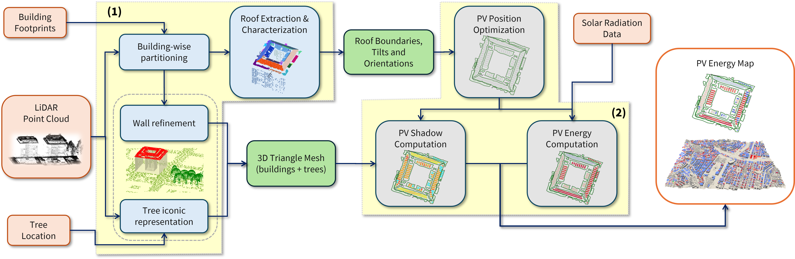

# PanelLib

**Algorithm for estimating the photovoltaic (PV) energy potential of building roofs**

This repository contains the implementation of the algorithm described in the paper *"Geometry-aware estimation of photovoltaic energy from aerial LiDAR point clouds"*.

<p align="center">
  
</p>

## Overview

PanelLib provides a complete pipeline for analyzing the photovoltaic potential of urban buildings using aerial LiDAR point clouds. The system automatically processes point cloud data to identify roof structures and estimate their solar energy generation capacity.

### Key Features

- **Automated roof segmentation** from LiDAR point clouds
- **Geometric analysis** of roof pitches and orientations
- **Solar irradiance modeling** with seasonal variations
- **PV panel placement optimization**
- **Energy yield estimation** for individual buildings or entire districts

## Architecture

The system is built on three main components:

1. **`PiP-partitioning`** - Partitions input point clouds by building footprints
2. **`extraction_of_roof_pitches`** - Identifies roof boundaries and slope characteristics
3. **`photovoltaic_energy`** - Calculates PV energy potential for each building

## Installation

### Prerequisites

Before building PanelLib, ensure you have the following dependencies installed:

- **CGAL 5.5** or higher
- **CMake 3.15** or higher
- **MATLAB** (with required toolboxes - *documentation pending*)
- **C++17** compatible compiler

### Clone the Repository

```bash
git clone --recursive https://github.com/TommasoSorgente/PanelLib.git
cd PanelLib
```

### Build

Execute the build script:

```bash
chmod +x scripts/build.sh
./scripts/build.sh
```

### Data Setup

Download the required data from the link [DATA DRIVE](https://cnrsc-my.sharepoint.com/personal/daniela_cabiddu_cnr_it/_layouts/15/onedrive.aspx?e=5%3A4d0c976374ad4389a8ade3ad7747b522&sharingv2=true&fromShare=true&at=9&CID=4807ee8e%2D45d5%2D4870%2Db9da%2Dd3a153fee514&id=%2Fpersonal%2Fdaniela%5Fcabiddu%5Fcnr%5Fit%2FDocuments%2FConferences%2FSMI2025%2FReplicability&FolderCTID=0x0120004FE7B604C1280744B61B5749FDB8E8B9&view=0):
- `pointcloud.las` - LiDAR point cloud (EPSG 7791)
- `footprints/` - Building footprint shapefiles
- `city_summer.obj`, `city_winter.obj` - Seasonal 3D city models
- `sun/` - Solar irradiance database

*Data source: [Genoa Municipality Geoportal](https://mappe.comune.genova.it/MapStore2/#/viewer/1000003072)*

## Usage

### Quick Start

1. **Prepare your data**: Place your LiDAR point cloud and building footprints in the `data/` directory

2. **Run the preprocessing pipeline**: This has to be launched only once.
   ```bash
   ./scripts/run_partitioning.sh
   ./scripts/run_extraction.sh
   ```

3. **Configure parameters**: Edit the parameters file according to your requirements. You can find two examples in the `scripts` folder (for a single building and a whole city), and pre-set parameters files for reproducing the paper results in the `parameters_files` folder.

4. **Execute analysis**:
   - For single building analysis: `./scripts/run_photovoltaic_building.sh`
   - For city-wide analysis: `./scripts/run_photovoltaic_city.sh`

### Output

When launched with the script `run_photovoltaic_building.sh` the program exports .obj meshes of each roof, buffered roof, and PV system, a list of the PV modules installable on each roof with energy details, and shows a preview of the results.

With the script `run_photovoltaic_city.sh`, due to the large number of buildings, the program does not export meshes, and an `output_photovoltaic_city.csv` file is generated with the number of roofs, PV modules and energy of each building.

### Visualization

Results can be visualized using ParaView with the included Python scripts `visualize_building.py` and `visualize_city.py`. The system will prompt for:
- Output directory path, for building-level analysis (e.g., `/home/tommaso/PanelLib/data/output_photovoltaic_single_building`)
- Module file and mesh file paths, for city-level analysis (e.g., `/home/tommaso/PanelLib/data/output_photovoltaic_city.csv`, `/home/tommaso/PanelLib/data/city_summer.obj`)

## Reproducing Paper Results

We provide predefined parameters files for reproducing Fig. 10, 11, 12, 13, and 14 of the paper:

1. Navigate to `parameters_files/` and choose the appropriate configuration
2. Update the `parameters` variable in the run script
3. Execute the analysis
4. Use the provided ParaView scripts for visualization

Note that, for reproducing Fig. 10(b) you will have to change the color scale to `Cold and Hot`.

## License

This project is licensed under the MIT License - see the [LICENSE](LICENSE) file for details.

## Citation

If you use PanelLib in your research, please cite our paper:

```bibtex
@article{romanengo2025geometry,
  title={Geometry-aware estimation of photovoltaic energy from aerial LiDAR point clouds},
  author={Romanengo, Chiara and Sorgente, Tommaso and Cabiddu, Daniela and Belussi, Lorenzo and Danza, Ludovico and Ghellere, Matteo and Mortara, Michela},
  journal={Computers \& Graphics},
  year={2025},
  publisher={Elsevier},
  note={In press}
}
```

## Authors

- **Tommaso Sorgente** - CNR-IMATI, Genova, Italy
- **Chiara Romanengo** - CNR-IMATI, Genova, Italy  
- **Daniela Cabiddu** - CNR-IMATI, Genova, Italy

## Acknowledgments

This work is partially supported by the project “House of emerging technologies of Matera” (CTEMT) funded by the Ministry of Economic Development of Italy, CUP I14E20000020001. 
All authors are members of the RAISE Innovation Ecosystem, funded by the European Union - NextGenerationEU and by the Ministry of University and Research (MUR), National Recovery and Resilience Plan (NRRP), Mission 4, Component 2, Investment 1.5, project ``RAISE - Robotics and AI for Socio-economic Empowerment'' (ECS00000035).
T. Sorgente is affiliated to the Italian Gruppo Nazionale Calcolo Scientifico - Istituto Nazionale di Alta Matematica (GNCS-INdAM).
We also thank the Genova municipality for the LiDAR data of the city.

## Support

For questions or support, please:
- Open an issue on GitHub
- Contact the authors directly
- Check the [documentation](docs/) (coming soon)

---

**Keywords**: Primitive Fitting, Primitive Recognition, Semantic Segmentation, Photovoltaics, Urban Digital Twins, Computational Geometry.
